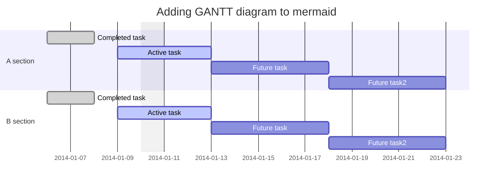

# Index
<a href="#cards"><h3>∘Cards</h3></a>
<a href="#mermaid"><h3>∘Mermaid</h3></a>

<div align="center">
  
  # Cards</h1>
  
</div>

___

<div align="center">
  
  # Mermaid</h1>
  
</div>

```
Source: https://mermaid.js.org/
```

Mermaid is a simple and easy tool to learn that allows you to implement diagrams and charts, right now there's 9 different types of charts available.

<ol>
  <li><a href="#flowchart">Flowchart</a></li>
  <li></li>
  <li></li>
  <li></li>
  <li></li>
  <li></li>
  <li></li>
  <li></li>
  <li></li>
</ol>

### Flowchart


